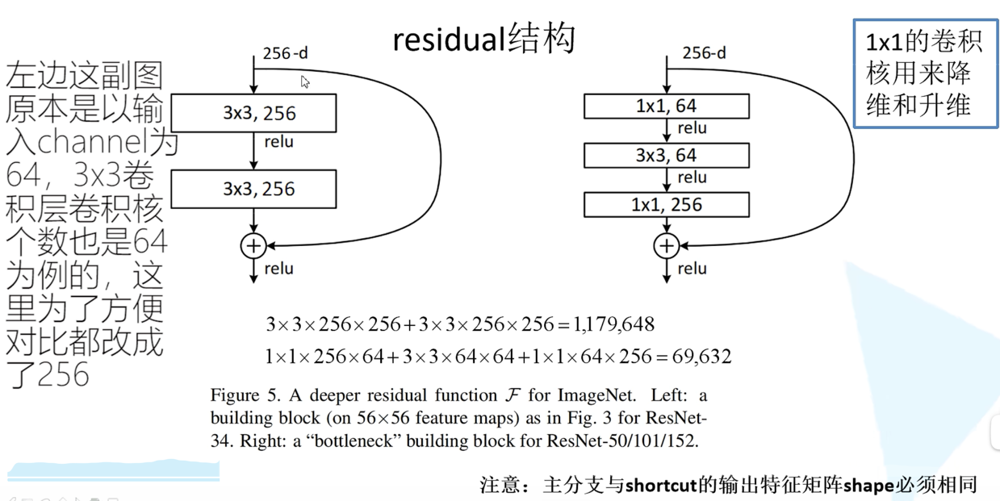
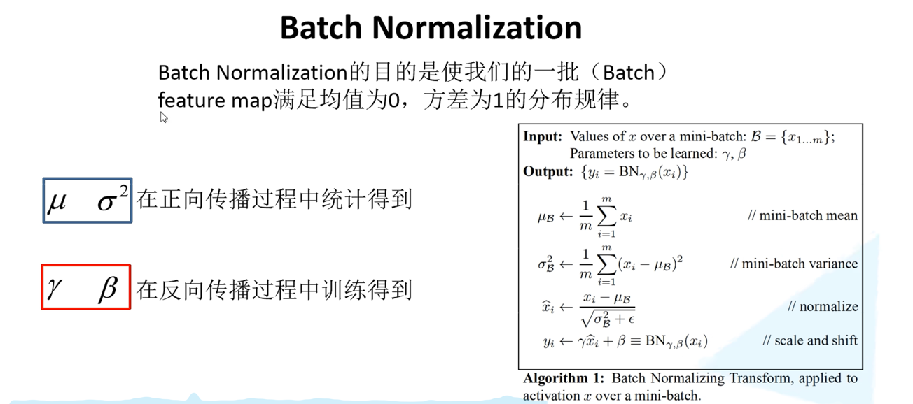

# Deep-learning-for-image-processing
## GoogLeNet
### Inception结构
- 传统CNN在同一层使用固定大小的卷积核，而GoogleNet采用Inception模块，在同一层使用不同大小的卷积核（1×1、3×3、5×5）并行提取特征，同时结合最大池化，提升模型能力。
- 卷积用于降维和非线性变换，减少计算量，防止特征图过大带来的计算开销。

### 更深的网络但更少的参数

- GoogleNet相比VGG更深（22层 vs. 19层），但参数量远小于VGG（VGG-16约138M参数，而GoogleNet仅有5M），主要通过1×1卷积降维减少计算量。

### 去除全连接层，改用全局平均池化（GAP, Global Average Pooling）

- 传统CNN（如AlexNet、VGG）使用全连接层（FC）作为最后的分类层，占用大量参数。GoogleNet使用全局平均池化（在每个特征图上取平均值）减少参数，同时防止过拟合。

## ResNet

### 更深的网络结构
- 突破1000层，而不会因为深度过大导致模型退化。
### 提出residual结构（参差结构），解决退化问题，以达到更深的网络结构

### 使用Batch Noramlization加速训练，且解决梯度消失和梯度爆炸问题（丢弃dropout方式）

 